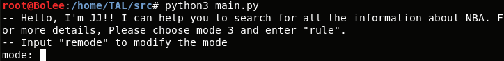
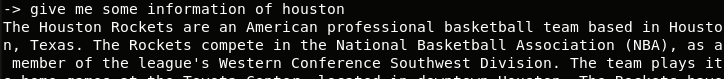

Projet TAL
=====================================================

# Tips for launching this chatbot
(Without step3 and step4, chatbot can't reply with the general answer)

## Step 1:

$git clone https://github.com/fanzheng199525/TAL.git

## Step 2:

$cd src

## Step 3:

Go to the google drive (url = https://drive.google.com/open?id=1i0ofe6_vbzmGePG2ymG_gwPDgm-FRB47) to download the folder “model” which have our training data. And replace the folder “model” in the folder src

## Step 4:

$pip3 install -r requirements.txt

## Step 5:

$python3 main.py

By the way, if you fail with installing the requirements, just change the name mode33.py to mode3.py. It will work with a simple verison. 

An example of execution:
After input the command python3 main.py, you will see:

 
First, I choose the mode 3, and input: tell me the matched on 05/03/2018

 
Then, I input: please tell me the score of CLE and TOR on 05/03/2018

 
Next, I want to get something about kobe bryant, i type: I want some info about kobe

 
After that, I want to get some info about the team Houston Rocket, I type:give me some information of houston

 
Now, I want to say something else, I input:nice to meet you (there is a warning about tensorflow)

 
I want to change the mode, so I type:remode,and choose the mode 2.

 
  
